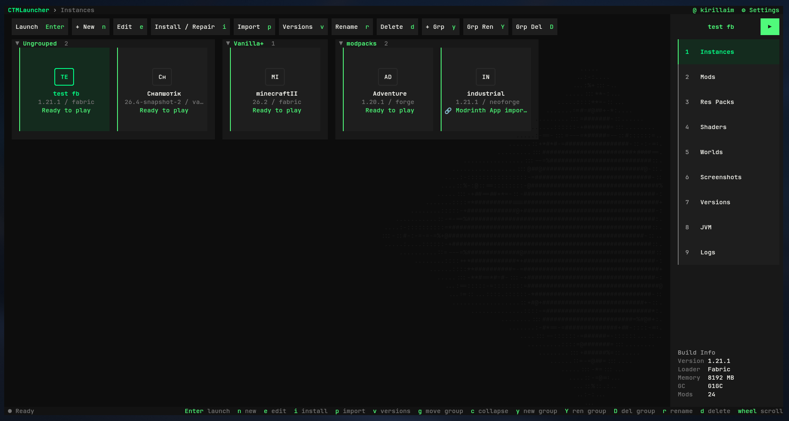
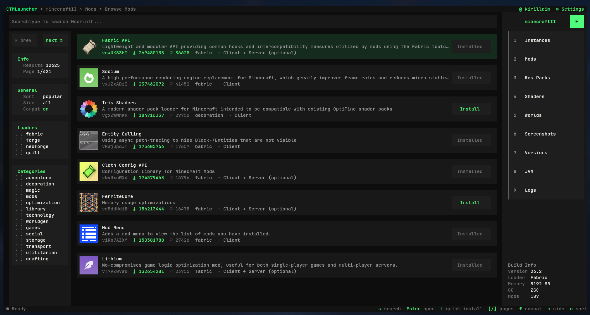
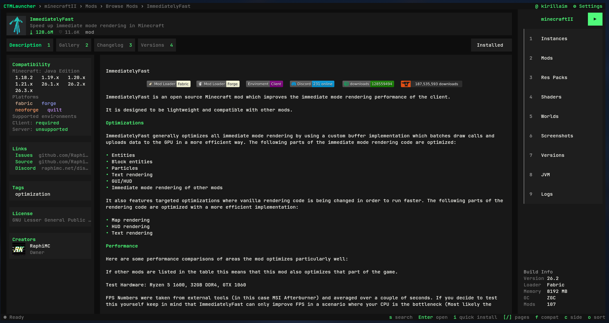
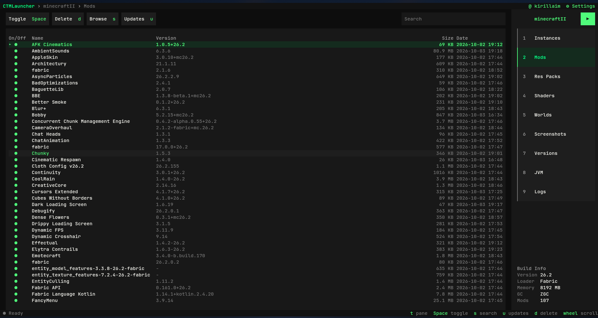
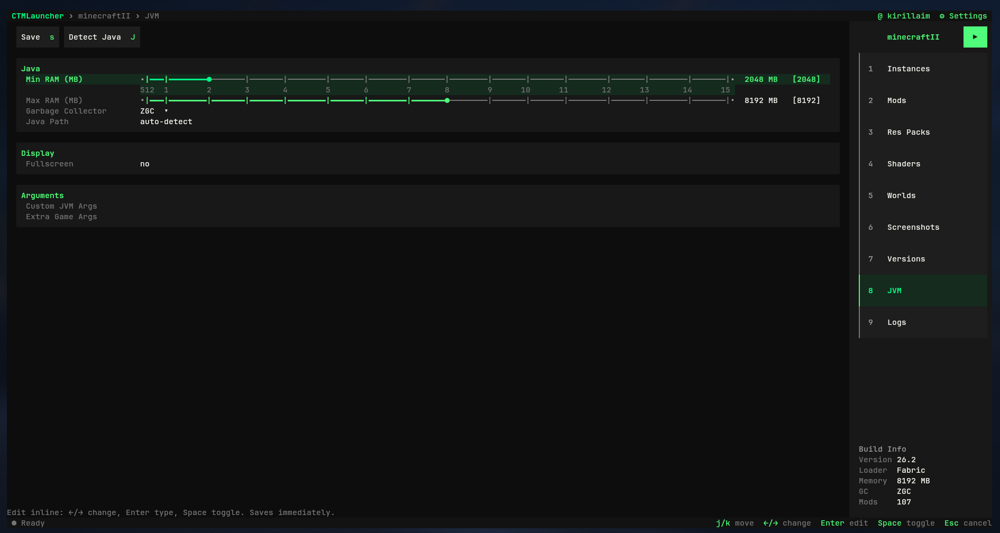
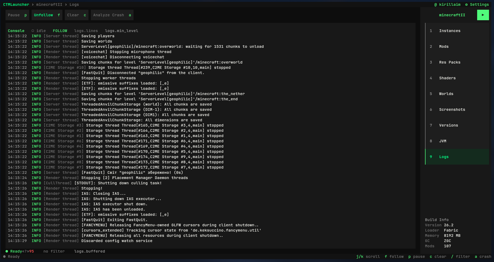
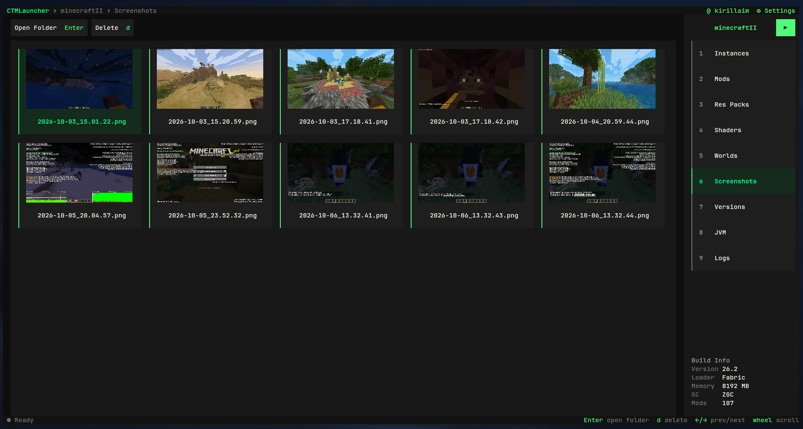

# CTMLauncher

**A modular terminal (TUI) Minecraft: Java Edition launcher — the Prism Launcher and Modrinth App workflow, rebuilt for the keyboard.**

CTMLauncher runs entirely inside your terminal: create and organize instances, install mod loaders, browse Modrinth, manage mods and logs, sign in with a Microsoft account, and launch the game — without ever leaving a text UI. It is fully operable with the mouse as well as the keyboard.

> **Status: active development (v0.1.0).** The launcher is usable day to day, but the project is still pre-1.0: features, layouts and settings formats may change. Bug reports and ideas are welcome.

---

## Screenshots

**Instances** — grouped tiles with per-instance loader, version and launch state:



**Modrinth browser** — search with filters (loaders, categories, side, compatibility) and one-key install:



**Project page** — description, gallery, changelog and version list:



**Installed mods** — toggle, delete, search and check for updates in one table:



**JVM settings** — RAM sliders capped to your physical memory, garbage collector, Java path, custom JVM/game arguments:



**Logs** — live game console with follow/pause/filter and crash analysis:



**Screenshots** — in-game screenshots browsed as a gallery, straight from the terminal:



---

## Highlights

### Instances
- Create, edit, copy, rename, group and delete instances; collapsible groups with counts.
- Launch, install/repair and per-instance version management (snapshots and releases).
- Import **`.mrpack`** mod packs and detect instances from other launchers (Prism, MultiMC, Modrinth App).
- Build info pane: version, loader, allocated memory, GC and installed mod count.

### Mod loaders
- **Vanilla**, **Fabric**, **Quilt**, **Forge**, **NeoForge** — install and repair straight from the UI, driven by the official loader metadata (fabricmc / quiltmc / forge / neoforged).

### Modrinth integration
- Search and browse mods, resource packs, shaders and modpacks with sorting, category/loader filters and compatibility filtering.
- Full project page: rendered description, image gallery, changelog, and every published version.
- One-key quick install into the selected instance; installed state shown inline.

### Content management
- Per-instance **Mods** (toggle, delete, search, update check), **Resource Packs**, **Shaders**, **Worlds** and **Screenshots** pages.
- Open the screenshots folder, preview gallery, and manage in-game captures without a file manager.

### Logs & crash analysis
- Streaming console with follow/pause, level filter and search.
- One-key crash report analysis that points at the likely cause.

### Accounts
- **Microsoft sign-in** via the OAuth 2.0 device authorization grant (see below).
- **Offline accounts** for local/offline play.
- Account store is a local JSON file written with `0600` permissions.

### Terminal-first UX
- Borderless, flat, dark card design with a single accent colour — no box-drawing chrome.
- **Full mouse support**: every actionable region is clickable (buttons, rows, sliders, tabs).
- Global shortcuts, on-screen hints, a help overlay (`?`), toasts and progress bars.
- Images render through **kitty / sixel / iTerm2** graphics protocols when available, with a half-block fallback that works in any terminal.
- Interface languages: **English, Ukrainian, Russian** (switchable in Settings; English is the language of this document).

---

## Microsoft account sign-in

CTMLauncher uses its **own public-client application registration** in Microsoft Entra (Azure AD) with the OAuth 2.0 **device authorization grant** (device code flow):

1. The launcher requests a device code and shows you a URL and a short code.
2. You open `https://www.microsoft.com/link` in **your own browser** and enter the code there.
3. Your password is typed **only on Microsoft's own pages** — the launcher never sees or stores credentials.
4. The launcher exchanges the result for an Xbox Live token, an XSTS token and finally a Minecraft session token.

Security and privacy properties:

- Tokens and refresh tokens are stored **only on your machine**, in `accounts.json` with `0600` (owner-only) file permissions. They are never logged and never sent anywhere except to Microsoft / Xbox / Minecraft services endpoints.
- The launcher performs **no telemetry, analytics, crash reporting or ad loading**, and contacts no third-party servers other than the official ones listed below.
- You can delete your account from the launcher at any time; removing it deletes the stored tokens.

> **Note:** Minecraft Services only accepts client IDs on Mojang's allowlist. CTMLauncher's client ID went through Mojang's official review process (`https://aka.ms/mce-reviewappid`) and is approved — Microsoft sign-in works end to end.

## Network endpoints contacted

| Host | Purpose |
|------|---------|
| `piston-meta.mojang.com`, `launchermeta.mojang.com` | Official version manifests and version metadata |
| `resources.download.minecraft.net`, `libraries.minecraft.net` | Game assets and libraries |
| `api.mojang.com`, `api.minecraftservices.com` | Profile / Minecraft session services |
| `login.microsoftonline.com`, `user.auth.xboxlive.com`, `xsts.auth.xboxlive.com` | Microsoft and Xbox sign-in |
| `api.modrinth.com`, `cdn.modrinth.com`, `img.modrinth.com` | Modrinth catalogue, files and images |
| `meta.fabricmc.net`, `meta.quiltmc.org` | Fabric / Quilt loader metadata |
| `maven.minecraftforge.net`, `maven.neoforged.net` | Forge / NeoForge installer artifacts |

All game files are downloaded from Mojang's official distribution endpoints. CTMLauncher does not bundle, redistribute or modify Minecraft itself; a valid Minecraft: Java Edition licence is required.

---

## Getting started

### Requirements
- Rust **1.75+** (build only)
- A terminal with decent Unicode support (kitty, foot, Alacritty, WezTerm, GNOME Terminal, …)
- A Java runtime for the game — common JDK/JRE locations are auto-detected, or point CTMLauncher at one in settings

### Build and run

```bash
git clone https://github.com/11kkiirr/CTM_launcher.git
cd CTM_launcher
cargo build --release -p mc_tui
./target/release/ctmlauncher
```

For development:

```bash
cargo run   -p mc_tui             # run the TUI
cargo test  -p mc_core -p mc_tui  # unit + UI render tests
cargo clippy -p mc_tui            # lint
```

---

## Architecture

```
crates/
├── mc_core/   headless engine: instances, installers, launch pipeline,
│              Microsoft/offline auth, Modrinth client, logs, import — no UI deps
└── mc_tui/    ratatui frontend: views, key/mouse handling, i18n, theming
               → binary `ctmlauncher`
```

Built on **tokio**, **reqwest** (rustls), **ratatui/crossterm** and **serde**. The engine crate never depends on terminal libraries, so the whole domain logic is testable headlessly (200+ tests).

---

## Roadmap / known limitations

- The interface is keyboard + mouse driven; touch/mobile terminals are out of scope.
- OS keyring integration for stored refresh tokens is planned (currently `0600` file).

---

## License & disclaimer

MIT — see [LICENSE](LICENSE).

CTMLauncher is an independent, non-commercial project. It is **not** affiliated with, endorsed by or connected to Mojang Studios, Microsoft, Prism Launcher or Modrinth. Minecraft is a trademark of Mojang AB. Use of Minecraft is governed by the [Minecraft EULA](https://www.minecraft.net/eula) and usage guidelines.
